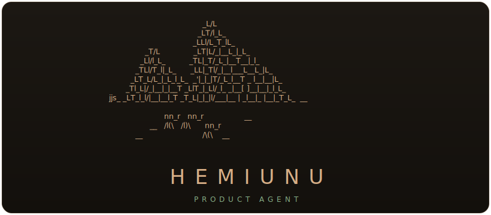

<div align="center">



</div>

An organization-wide AI **Product Agent** for a product team, built on the
[Claude Agent SDK](https://docs.claude.com/en/api/agent-sdk) (TypeScript).

The current build is the **CLI MVP**: a product-knowledge agent that answers
questions grounded in your connected sources (Notion, local files, any MCP
server), remembers what it learns, and keeps full conversations on disk. The
long-term vision — prototyping (wireframes → design system → deploy), a hosted
web app, and per-user auth — lives in [`FINAL_PLAN.md`](./FINAL_PLAN.md).

## What it does today

- **Chat REPL** (Ink TUI) with a pyramid banner, live status line, and
  Claude-Code-style streaming.
- **Grounded answers** — connects to MCP servers (Notion read-only, local
  filesystem, or anything you add to `mcp.json`) and searches them before
  answering. Every tool call is gated by a **yes / always / no** permission
  prompt (queued, arrow-key select, `Esc` to interrupt).
- **Researcher subagent + model tiers** — for anything that needs looking
  things up, the main model delegates retrieval to a `researcher` subagent
  running on a **cheaper tier** (`HEMIUNU_MODEL_RESEARCH`, default Sonnet),
  then synthesizes the findings on the main model. The CLI shows the
  delegation (`⌂ researcher · sonnet`) and the subagent's source calls.
- **Other models as tools** — an `ask_model` tool lets the Claude agent
  consult any non-Claude model on the proxy (Gemini, GPT, Grok, DeepSeek,
  Qwen, …) for a second opinion or a specialized subtask, then integrate the
  result. Claude stays the brain; other models are tools it calls.
- **Wireframes (low-fi)** — ask Hemiunu to mock up a screen or flow and it
  assembles a brief from your sources, then a `prototyper` subagent generates a
  self-contained grayscale HTML wireframe into the prototype workspace (flat —
  `index.html` alongside `PROTOTYPE.md`) and opens it in your browser. With no
  team that workspace is a local session folder under `~/.hemiunu/tmp/local/`;
  create a team and it's pushed into the repo. Structure and flow first; the
  design system comes later.
- **Parallel execution** — when a task splits into independent pieces, a
  `parallel` tool fans them out across subagents concurrently (real code-level
  fan-out, not the model's sequential dispatch), each in its own isolated
  context, and merges the results. Genuinely parallel + no cross-contamination.
- **File-based context construction** (Hermes-inspired): each turn the system
  prompt is assembled from three homes — `context/soul.md` (persona, ships with
  the app), a **global** `user.md` of learned user facts in `~/.hemiunu/`
  (carried into every project), and a **per-project** `HEMIUNU.md` at the root
  of the folder you launched in (the agent's notes about *this* project, like a
  `CLAUDE.md`). The agent updates the latter two **autonomously** via a
  `remember` tool (`target: "user"` → global, `"memory"` → this project). The
  global `user.md` is seeded empty from the committed `user.md.example` on first
  run; per-project `HEMIUNU.md` files are created only when the agent first saves
  a note there.
- **Persistent conversations** in SQLite (`~/.hemiunu/hemiunu.db`) — list,
  resume, replay.
- **Adaptive context management** — per-model context window with automatic
  compaction (rolling summary) plus `/compact` and `/clear`.
- **Runtime model switching** via `/models` (lists the Claude models your key
  exposes on the proxy).

## Install

One line (requires **Node 24+**):

```bash
curl -fsSL https://raw.githubusercontent.com/AntoineF23/hemiunu/main/install.sh | bash
```

This clones Hemiunu to `~/.hemiunu/app`, installs dependencies, and puts the
`hemiunu` command on your PATH. Then just run it:

```bash
hemiunu
```

**On first run it asks for your Anthropic API key** (the Claude brain) and,
optionally, a gateway base URL and Notion / Tavily tokens — no file editing.
Your keys are saved to `~/.hemiunu/.env`. `/setup` shows where they live; `/mcp`
shows connected servers.

**Models are bring-your-own.** The brain is Claude (Anthropic directly, or any
Anthropic-compatible gateway via `ANTHROPIC_BASE_URL`). The `ask_model` tool can
consult other providers (OpenAI, Google, Groq, xAI, DeepSeek, Mistral) — add
each provider's key to `~/.hemiunu/.env` (`OPENAI_API_KEY`, `GEMINI_API_KEY`, …)
to enable it; if a key is missing, the agent tells you which one to add.

Re-run the install command any time to update — your config in `~/.hemiunu/`
is never touched. **Your settings live in `~/.hemiunu/`, separate from the
code:** keys in `~/.hemiunu/.env`, and your own MCP servers in
`~/.hemiunu/mcp.json` (merged over the defaults — add servers there). File
access and folder-trust follow the directory you launch in, so `hemiunu` in a
project lets the agent read *that* project, with its brain from the install.

## Setup from source

Requires Node 24+ (uses the built-in `node:sqlite`). Uses pnpm — via Corepack
(`corepack pnpm …`), an installed `pnpm`, or `npx pnpm …` if you have neither.
The `curl | bash` installer above resolves this for you automatically.

```bash
corepack pnpm install
cp .env.example .env      # then fill in your key (see below)
corepack pnpm dev         # launch the CLI (from the repo)
corepack pnpm link --global   # optional: expose the `hemiunu` command
```

### Configuration (`.env`)

| Variable | Purpose |
| --- | --- |
| `ANTHROPIC_API_KEY` | Key for the Claude brain. **Required.** |
| `ANTHROPIC_BASE_URL` | *Optional.* Anthropic-compatible gateway/proxy. Unset = Anthropic direct. |
| `HEMIUNU_MODEL` | Main / synthesis model id, e.g. `claude-opus-4.8` / `claude-sonnet-4.6`. |
| `HEMIUNU_MODEL_RESEARCH` | Retrieval tier for the `researcher` subagent (default `claude-sonnet-4.6`). Haiku isn't supported — see note below. |
| `OPENAI_API_KEY`, `GEMINI_API_KEY`, `GROQ_API_KEY`, `XAI_API_KEY`, `DEEPSEEK_API_KEY`, `MISTRAL_API_KEY` | *Optional, per provider.* Enable that provider for the `ask_model` tool. |
| `NOTION_TOKEN`, `TAVILY_API_KEY` | *Optional.* Enable the Notion / Tavily MCP servers. |
| `HEMIUNU_THINKING_BUDGET` | Extended-thinking tokens. `0`/unset = disabled (cheaper, works everywhere). |
| `HEMIUNU_CONTEXT_WINDOW` / `HEMIUNU_COMPACT_THRESHOLD` | Context window override / auto-compaction threshold (default `0.5`). |

### Connecting MCP servers

Edit [`mcp.json`](./mcp.json) (standard `mcpServers` shape — `stdio`, `http`,
or `sse`). Use `${ENV_VAR}` for secrets (kept in `.env`); `${CWD}` resolves to
the launch directory. A server is auto-skipped if it's `disabled` or any of its
env vars are unset. `/mcp` in the CLI shows connection status.

On startup the CLI asks whether to **trust the current folder** for file
access; the decision is remembered per folder. `/trust` re-opens it.

## Slash commands

`/new` `/clear` `/compact` `/models` `/setup` `/trust` `/list` `/resume`
`/mcp` `/skills` `/help` `/exit`

## Skills

**Skills** are reusable, saved procedures — each a Markdown file in the canonical
Claude `SKILL.md` structure (YAML frontmatter + instruction body), stored
per-user in `~/.hemiunu/skills/` so they persist across every session and
project.

```md
---
name: weekly-report
description: Draft the weekly product status report from Notion updates.
argument-hint: "[week]"
---
Gather this week's updates from Notion (delegate to the researcher), then write a
concise status report covering shipped / in-progress / blocked, scoped to:
$ARGUMENTS
```

- **Run one** with its slash command: `/weekly-report Q3` (the body becomes the
  turn's prompt; `$ARGUMENTS` / `$1`, `$2`… are filled from what you type).
- **Discover** — `/skills` lists what you have. The `description` of each skill
  is surfaced to the agent (metadata only), so it can recognise when a request
  matches a skill and follow it; the full body is loaded only when it runs.
- **Create / edit two ways:** (1) ask the agent ("save a skill that…") and it
  writes the file via its `save_skill` tool; or (2) edit the `.md` directly —
  changes take effect on the next run, no restart. Both flat `skills/<name>.md`
  and bundled `skills/<name>/SKILL.md` forms work.

## Teams & prototype knowledge

A **team = a feature = a repo** (1:1). **One team per terminal:** on launch
Hemiunu asks which team to work on (skipped on a fresh install — you start local
and it offers to create one). To work on **several teams at once, open another
terminal** and pick a different team there — each is its own isolated session,
pinned to its own repo, so they never step on each other.

```bash
hemiunu                 # pick a team interactively
hemiunu owner/repo      # start on that team (added if new)
hemiunu local           # start with no team (local iteration)
```

The current team is shown under the chat. Within a terminal, **Shift+Tab**
switches teams sequentially, `/team` opens a switcher, and `/team <owner/repo>`
adds/switches one. To start a new feature, **`/team-new <name>`** creates a fresh
**private** repo named after it and switches in (`/team-new org/<name>` for an
org). Each team carries its own conversation + context.

Every feature has a living **`PROTOTYPE.md` at its repo root** — the feature's
brief and memory (goal, primary user, research findings + sources, decisions,
open questions). The agent maintains it **proactively** (like `remember`): as it
learns durable things about the feature it appends them, and reorganizes the doc
when useful — all straight through the GitHub API, so it (or a teammate) can
enrich a feature **without cloning the repo**.

### Connect GitHub

Run **`/github`** — the agent connects your account via GitHub's OAuth **device
flow** (no `gh` install, no hand-made token): it shows a short code, opens
`github.com/login/device`, and once you authorize it saves the token to
`~/.hemiunu/.env` and never asks again. `/github` alone shows who you're signed
in as. (Fallback: `/github <token>` with a fine-grained PAT that has *Contents:
read & write* on the repo.)

Device sign-in needs a one-time **GitHub OAuth App** (its client id is public):

1. GitHub → *Settings → Developer settings → OAuth Apps → New OAuth App*.
2. Any name/homepage; the callback URL is unused by device flow (put the homepage).
3. After creating, tick **Enable Device Flow**, and copy the **Client ID**.
4. Provide it to Hemiunu: set `HEMIUNU_GITHUB_CLIENT_ID` in `~/.hemiunu/.env`
   (or paste it into `DEFAULT_GITHUB_CLIENT_ID` in `packages/agent-core/src/github.ts`
   to ship it for everyone).

The device flow grants the classic `repo` scope (covers Contents read/write on
the user's private repos).

## Smoke / eval harness

A tiny harness gates the MVP end-to-end:

```bash
corepack pnpm smoke            # offline checks + one live turn through the proxy
corepack pnpm smoke --offline  # structural checks only — no API calls, no cost
```

Offline checks (free, deterministic): config loads, the system prompt is built
from `context/`, `mcp.json` parses into tool patterns, servers with unset env
are skipped, and `remember()` writes to disk. The live section runs one real
turn (the M0 gate) and verifies the persona is wired through. It uses
`HEMIUNU_MODEL` by default; override with `HEMIUNU_EVAL_MODEL`.

## Repo layout

```
apps/
  cli/          # Ink chat REPL — banner, slash commands, permission menu, status line
  eval/         # smoke / eval harness
packages/
  agent-core/   # runTurn() — SDK query() wrapper: model/env/thinking config, remember tool
  memory/       # context loader (soul/user/memory) + remember() + SQLite conversation store
  mcp/          # mcp.json registry — stdio/http/sse, ${ENV} interpolation, auto-skip
context/         # soul.md (persona) · knowledge/design.md · user.md.example template
                 #   global user.md lives in ~/.hemiunu; per-project memory is
                 #   a HEMIUNU.md at the root of the folder you launch in
mcp.json         # connected MCP servers
```

## Planning docs

- [`FINAL_PLAN.md`](./FINAL_PLAN.md) — the full product vision.
- [`MVP_PLAN.md`](./MVP_PLAN.md) — the CLI MVP milestones (M0–M3).
- [`OAUTH_PLAN.md`](./OAUTH_PLAN.md) — deferred OAuth / token-broker design for
  OAuth-protected remote MCP servers.
